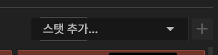
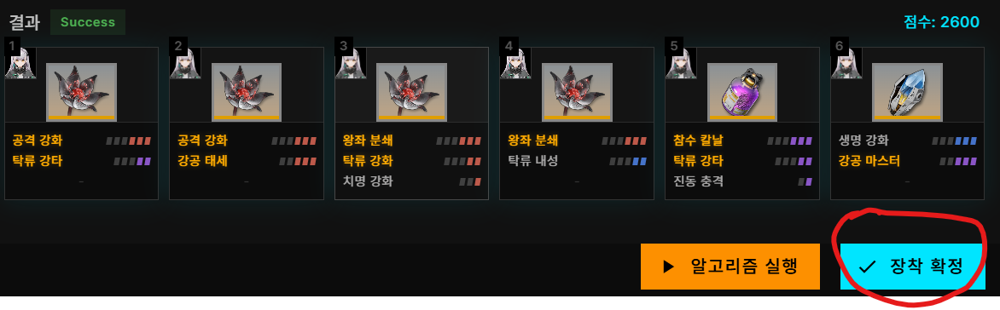

# RPFV-WebUI
**RPFV (Remolding Pattern For Vepley)**

공연밖에 모르는 베푸리도 리몰딩 패턴을 쉽게 관리 할 수 있도록 도와주는 웹 기반 에디터입니다.

웹페이지 링크: https://lambdalamshare.github.io/

  

## 핵심 기능
- 소전2 인게임과 거의 동일한 리몰딩 패턴 장착 시스템 구현
- 하나하나 클릭하지 않아도 스탯정보를 바로 보여주는 직관적인 아이템 UI
- 주스탯 필터링 & 스탯 검색 기능
- 커스터마이즈 가능한 자동장착 기능
- 인형 6명 기본 편성 단위 성장데이터 장착 관리

---

## 🚀 시작 가이드

### 1️⃣ 필요한 파일 준비

RPFV Editor를 사용하려면 아래 파일이 필요합니다.

- [gfl2logger-rpfv](https://github.com/lambdalamshare/gfl2logger-rpfv) 툴을 사용해 추출한 **성장데이터 목록 CSV 파일**  
  (예: `gfl2logger_remodings_....csv`)

  

> 💡 **참고**  
> 데이터가 준비되지 않았다거나 gfl2logger를 사용하기 싫다면  아래 **테스트 모드**를 통해 기능을 먼저 체험할 수 있습니다.

---

### 2️⃣ 앱 시작 및 데이터 로드

  

1. [RPFV WebUI](https://lambdalamshare.github.io/) 사이트에 접속하면 **시스템 초기화** 팝업이 자동으로 열립니다.

2. **「클릭해서 파일 업로드」** 버튼을 눌러 준비한 **CSV 파일**을 업로드합니다.

3. 업로드가 완료되면 **실행** 버튼을 클릭하여 메인 인터페이스로 이동합니다.

> ⚠️ **테스트 모드**  
> 좌측 하단에 **「테스트 모드」** 버튼을 클릭하면 테스트 전용 데이터를 사용해서 바로 기능을 체험해볼 수 있습니다! 본인의 데이터가 준비되지 않았다면 한 번 사용해보세요.
>{width=25%}
---

## 🖥 메인 인터페이스 가이드

### 1️⃣ 인형 추가하기

  

1. 화면 왼쪽 **편성 패널**에서 ** + ** 버튼을 클릭하여 팝업을 엽니다.
2. 드롭다운에서 원하는 인형을 선택한 후, **확인** 버튼을 눌러 추가를 완료합니다.
3. 여러 인형이 등록된 경우, **인형 슬롯을 클릭** 해서 선택을 변경할 수 있습니다.
4. 슬롯을 드래그하여 인형의 위치를 변경할 수도 있습니다.
---

### 2️⃣ 성장 아이템 장착하기

#### 아이템 장착 절차

  

1. 화면 하단 **성장데이터 슬롯 패널**에서 성장 데이터 슬롯을 클릭합니다.

2. 인벤토리 팝업이 열리며 보유 중인 성장데이터 아이템이 표시됩니다.

> 💡 **팁**  
> 인벤토리 상단의 **메인 스탯 필터**와 **스탯 검색**을 활용하면  
> 원하는 아이템을 빠르게 찾을 수 있습니다.

3. 아이템 카드를 선택한 뒤, 우상단의 **「장착」** 버튼을 클릭합니다. 
이미 다른 캐릭터/슬롯에 장착된 아이템은 버튼이 **「교체」** 로 표시됩니다.

<table>
  <tr>
    <td align="center">
   
       
      <b>일반 아이템</b>
    </td>
    <td align="center">
  
       
      <b>다른 캐릭터/슬롯에 장착된 아이템</b>
    </td>
  </tr>
</table>

> ⚠️ 주의!
교체를 확정하면 기존에 장착 캐릭터에서 자동으로 탈착되고, 현재 선택된 인형에 장착합니다. 

---

### 3️⃣ 리몰딩 스탯 목록 확인하기

화면 오른쪽 패널에서 **현재 장착된 성장데이터의 스탯 총합**을 확인할 수 있습니다.

  

- **상단 패널**
인형의 현재 현상인자 수치와 목표치를 보여줍니다.
목표치를 달성하면 노란색 테두리로 표시됩니다.

- **중앙 패널**에는 인형의 성장데이터 스탯 총합을 보여줍니다.
  - 별 표시: "자동장착"에 등록된 스탯들(아래 내용 참고)
  - 빛나는 흰색 바: 주스탯(공격 강화, 참수칼날 등) 
  - 좌측 숫자: 현재 레벨
  - 초과한 스탯: OVER 라는 붉은색 문자로 경고합니다.

---

## ⚙️ 고급 기능

### 🤖 자동 장착

자동 장착 기능은 **가중치 기반 백트래킹 알고리즘**을 사용하여 형상인자 조건을 만족하면서도 더 효율적인 스탯 조합을 추천합니다. 

또한, 알고리즘의 가중치를 본인이 원하는대로 설정할 수 있기 때문에 쉽게 커스터마이즈 할 수 있다는 장점이 있습니다.

처음에는 사용이 어려울 수 있기에 **개발자가 임의로 적절한 값**을 입력해 놓았습니다. 익숙해지면 조금씩 자신이 원하는 대로 수치를 바꿔가면서 사용해보세요!

참고: 인게임과의 비교 및 해설 [클릭]
 
<table>
  <tr>
    <td align="center">
      
       
      <b>인게임 자동장착(토로로)</b>
    </td>
    <td align="center">
      
       
      <b>RPFV 자동장착(토로로)</b>
    </td>
  </tr>
</table>

토로로는 <b>탁류 속성 + 센티널 딜러 + 단일피해 + 액티브 공격 유효</b> 라는 특성을 가졌기 때문에 해당 특성과 연관된 스탯들에 가중치가 높게 설정되어 있습니다. 

따라서, 인게임의 일괄장착 기능과 비교해서 캐릭터의 특성을 조금 더 잘 고려한 결과를 보여줍니다.

#### 사용 방법

  

1. **자동 장착 팝업 열기**
왼쪽 캐릭터 패널에서 **로봇 아이콘(🤖)** 클릭하여 열 수 있습니다.

2. **추가 옵션 패널을 확인**
  알고리즘의 기본적인 설정을 할 수 있습니다. 잘 모르겠으면 **타 인형 장착 포함** 옵션만 알고 있으면 됩니다.

   - **템 등급 조건**
   조합에 포함시킬 아이템의 최소 등급.**(군용급 or 정밀급 이상 권장)**
   - **최대 시행 횟수**
   조합을 찾기위해 수행하는 최대 작업 수. 숫자가 클수록 성공할 가능성이 높아지지만, 시간이 더 오래 걸릴 수 있음. **(50000 ~ 100000 권장)**
   - **타속성 패널티**
   이 수치가 낮을수록 다른 속성 스탯이 나타날 가능성이 줄어듬. **(-10 권장)**
   - **타 인형 장착 포함**
   이 옵션이 켜져있으면 다른 인형에 장착되어 있는 아이템도 포함.

3. **스탯 가중치 패널을 확인**

  

스탯별로 가중치를 설정하여 해당 스탯을 포함한 아이템이 선택될 가능성을 조정할 수 있습니다.

- 숫자가 높을수록 해당 스탯을 포함한 아이템이 선택될 확률이 증가
- (잘 모르겠으면 일단 기본값 그대로 진행해보세요!)

> 💡 **팁: 스탯 추가하기**  
> 새로운 스탯을 추가하는 것도 가능합니다! 상단의 스탯 추가에 원하는 스탯을 검색하고 우측에 `+` 버튼을 눌러서 추가하세요.
>

4. **알고리즘 실행**
하단의 **알고리즘 실행** 버튼을 눌러서 결과 조합을 확인합니다.
결과가 맘에 든다면, **장착 확정** 버튼을 눌러 캐릭터에게 장착시킵니다.
맘에 들지 않으면, 일부 수치를 조정하고 다시 **알고리즘 실행** 버튼을 눌러 새로운 조합을 찾아보세요.

> 💡 **팁**  
> 결과가 마음에 들지 않거나 혹시 실패 결과가 나왔다면 **시행 횟수**를 늘려보거나 **스탯의 가중치**를 전반적으로 조정해 보세요. 
> 꼴도 보기 싫은 스탯에는 음수 가중치를 부여할 수도 있습니다!

### 💾 편성 저장 & 불러오기

- 편성 저장하기
캐릭터 편성 툴바의 **디스크 아이콘** 을 클릭하면 현재 편성을 json 파일로 PC에 저장할 수 있습니다. 현재 편성한 인형, 아이템 장착 상태, 가중치 정보가 모두 저장됩니다. (아이템 목록은 저장하지 않습니다!)

- 편성 불러오기
저장 아이콘 좌측의 **로드 아이콘**을 누르면 저장해둔 편성 데이터를 선택하여 로드할 수 있습니다.

---

## ❓ FAQ

**Q. 내 게임 데이터가 서버로 전송되나요?**  
A. 아닙니다. 모든 처리는 브라우저 내에서만 수행되며 서버로 전송되지 않습니다.

**Q. 모바일에서도 사용할 수 있나요?**  
A. 현재는 **Windows PC + Chrome 데스크톱 환경** 위주로 개발 및 테스트되었습니다.  
모바일 환경은 안정적으로 지원하지 않습니다.

이 프로그램에서 사용된 리소스는 

