

# RPFV-WebUI
###  Remolding Pattern for Vepley - WebUI

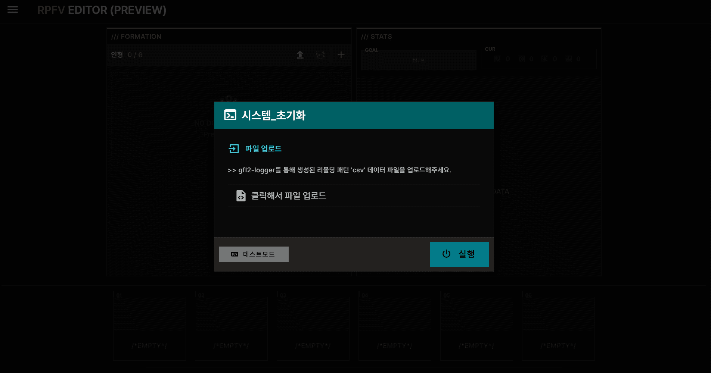

 

**공연밖에 모르는 베푸리도 리몰딩 패턴을 쉽게 관리할 수 있도록 도와주는 웹 기반 에디터입니다.**

[👉 웹 페이지 바로가기](https://lambdalamshare.github.io/)

---

## 📑 목차
1. [핵심 기능](#-핵심-기능)
2. [시작 가이드](#-시작-가이드)
3. [메인 인터페이스 가이드](#-메인-인터페이스-가이드)
4. [고급 기능 (일괄 장착)](#-고급-기능)
5. [데이터 관리](#-편성-저장--불러오기)
6. [FAQ](#-faq)

---

## ✨ 핵심 기능

* **소전2 리몰딩 패턴 장착 시스템 구현**
* **아이템을 일일히 클릭 필요 없는 직관적인 정보 확인**
* **아이템 필터링 및 검색 기능** 
* **개선된 일괄 장착 기능**

---

## 🚀 시작 가이드

### 1️⃣ 필요한 파일 준비
아래 툴을 사용하여 출력된 **[리몰딩 패턴 아이템 목록 csv]** 파일을 준비해주세요

* **필수 툴:** [gfl2logger-rpfv](https://github.com/lambdalamshare/gfl2logger-rpfv)
* **파일 형식:** `gfl2logger_remodings_....csv`

  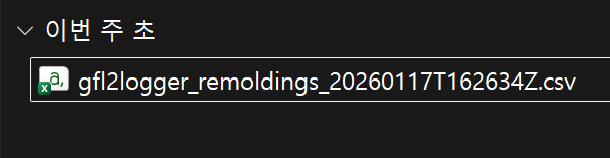

> **💡 참고**
> 데이터가 준비되지 않았거나 추출이 번거롭다면, 아래 **[테스트 모드]** 를 통해 기능을 먼저 체험할 수 있습니다.

### 2️⃣ 앱 시작 및 데이터 로드

  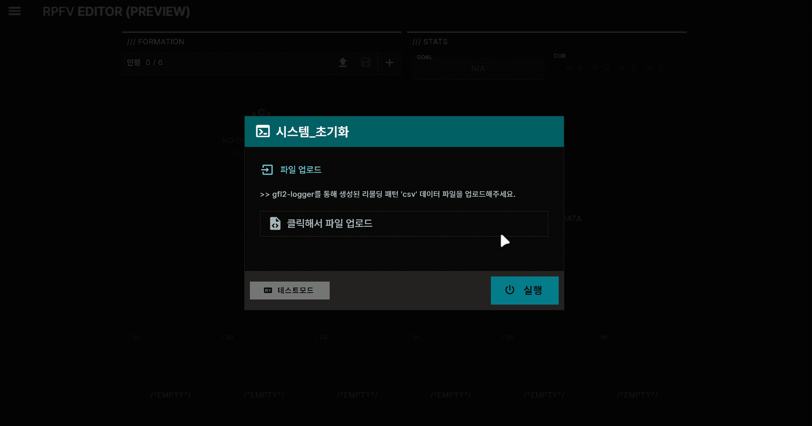

1.  **[RPFV WebUI](https://lambdalamshare.github.io/)** 사이트에 접속하면 **시스템 초기화** 팝업이 자동으로 열립니다.

2.  **「클릭해서 파일 업로드」** 버튼을 눌러 준비한 **CSV 파일**을 업로드합니다.

3.  업로드가 완료되면 **[실행]** 버튼을 클릭하여 메인 인터페이스로 이동합니다.

**⚠️ 테스트 모드 사용법**
좌측 하단에 **「테스트 모드」** 버튼을 클릭하면 테스트 전용 데이터를 사용해서 바로 기능을 체험해볼 수 있습니다! 본인의 데이터가 준비되지 않았다면 한 번 사용해보세요.
 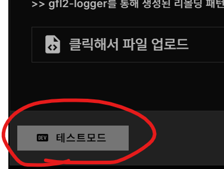

---

## 🖥 메인 인터페이스 가이드

### 1️⃣ 인형 추가하기
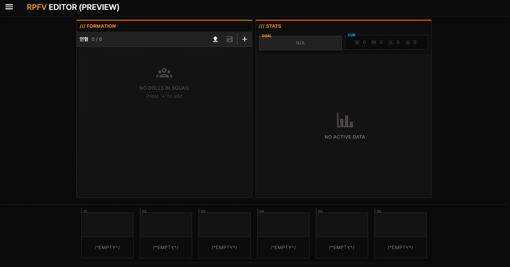

1.  화면 왼쪽 **편성 패널**에서 **`+`** 버튼을 클릭하여 팝업을 엽니다.

2.  드롭다운에서 원하는 인형을 선택한 후, **확인** 버튼을 눌러 추가를 완료합니다.

3.  여러 인형이 등록된 경우, **인형 슬롯을 클릭**해서 선택을 변경할 수 있습니다.

4.  슬롯을 드래그하여 인형의 위치(순서)를 변경할 수도 있습니다.

### 2️⃣ 성장 아이템 장착하기

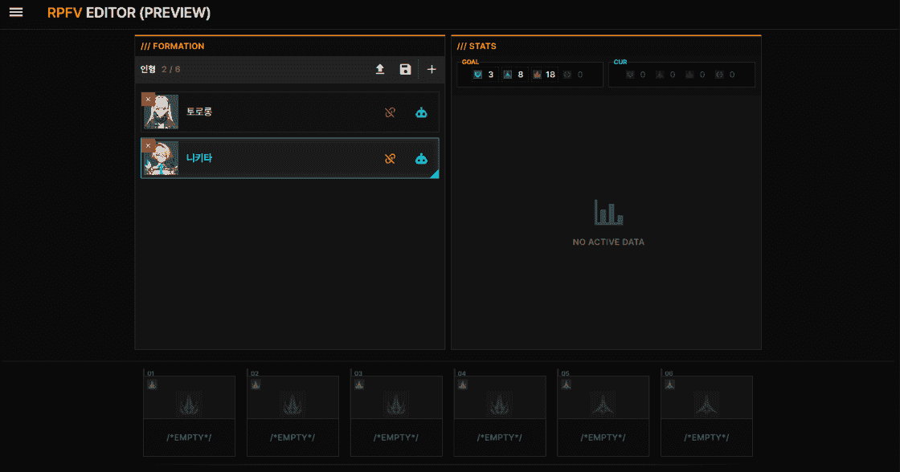

1.  화면 하단 **성장데이터 슬롯 패널**에서 빈 슬롯을 클릭합니다.

2.  인벤토리 팝업이 열리며 보유 중인 성장데이터 아이템이 표시됩니다.

3.  원하는 아이템 카드를 선택한 뒤, 우상단의 **「장착」** 버튼을 클릭합니다.

**이미 다른 슬롯에 사용 중인 아이템인 경우:**
버튼이 주황색 **「교체」** 버튼으로 표시됩니다.
교체를 확정하면 기존에 장착된 캐릭터에서 자동으로 탈착되고, 현재 선택된 인형에 장착됩니다.

| 일반 아이템 | 다른 캐릭터/슬롯에 장착된 아이템 |
| :---: | :---: |
| 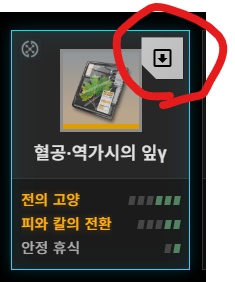 |  |
| **[장착]** | **[교체]** |

> **💡 팁**
> 인벤토리 상단의 **메인 스탯 필터**와 **스탯 검색**을 활용하면 원하는 옵션의 아이템을 빠르게 찾을 수 있습니다.

### 3️⃣ 리몰딩 스탯 목록 확인하기

화면 오른쪽 패널에서 **현재 장착된 성장데이터의 스탯 총합**을 확인할 수 있습니다.

  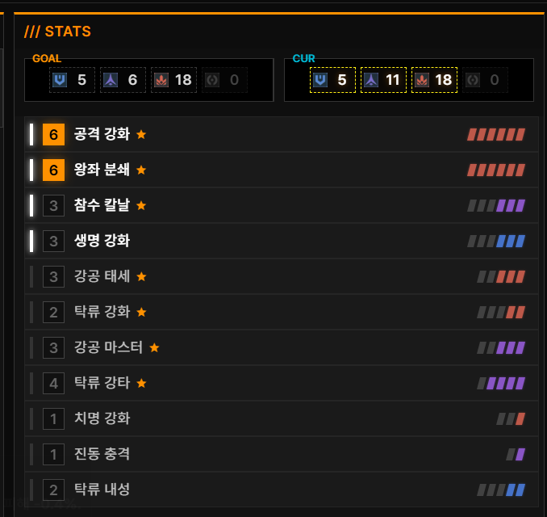

* **상단 패널:** 
인형의 현재 현상인자 수치와 목표치를 보여줍니다. (목표 달성 시 노란색 테두리 강조)

* **중앙 패널:**
인형의 성장데이터 스탯 총합을 보여줍니다.

---

## ⚙️ 고급 기능

### 🤖 일괄 장착

RPFV의 일괄 장착 기능은 **가중치 기반 백트래킹 알고리즘**을 사용하여 형상인자 조건을 만족하면서도 더 효율적인 스탯 조합을 추천합니다. 또한, 사용자가 직접 가중치를 설정하여 캐릭터 특성에 맞는 최적의 세팅을 찾을 수 있습니다.

  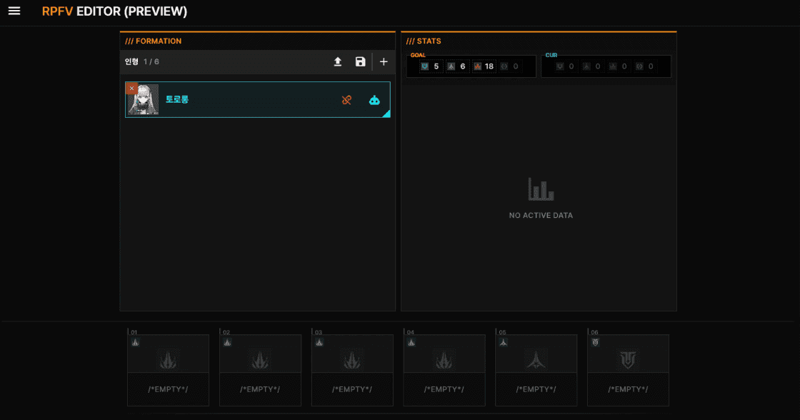

 비고: 인게임 vs RPFV 일괄 장착 비교

| 인게임 자동장착 (토로로) | RPFV 자동장착 (토로로) |
| :---: | :---: |
| 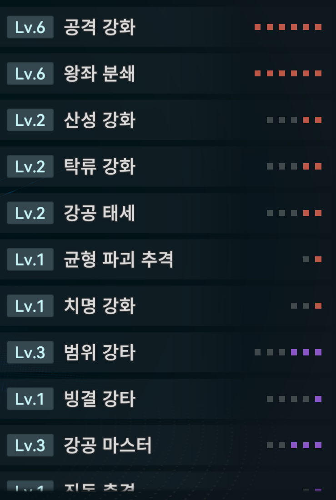 |  |

> **해설:** RPFV는 토로로의 특성을 고려하여 (탁류 속성 + 센티널 딜러 + 액티브 공격 유효)에 높은 가중치를 부여했기 때문에, 단순 인게임 장착보다 **유효 스탯을 훨씬 더 많이 챙긴 결과**를 보여줍니다.

#### 사용 방법

**1. 일괄 장착 팝업 열기**

왼쪽 인형 슬롯의 파란색 **로봇 아이콘** 버튼을 클릭하여 설정창을 엽니다.

  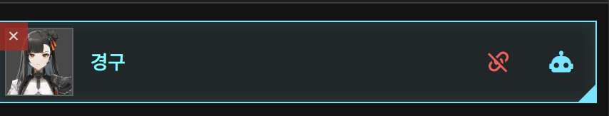

**2. 기본 설정 점검하기**

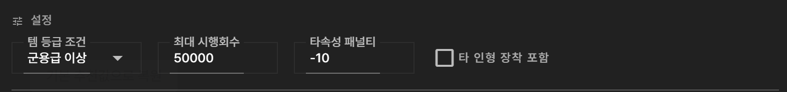

알고리즘의 동작 방식을 설정합니다. (잘 모르겠다면 **기본값**을 먼저 사용해보세요)

| 항목 | 설명 | 권장값 / 비고 |
| :--- | :--- | :--- |
| **템 등급 조건** | 조합에 포함시킬 아이템의 최소 등급 | **정밀급 이상** |
| **최대 시행 횟수** | 높을수록 성공 확률 증가 (단, 계산 시간 증가) | **50,000 ~ 100,000** |
| **타속성 패널티** | 원하지 않는 속성 스탯을 배제하는 정도 | **-10** |
| **타 인형 장착 포함** | 다른 인형이 착용 중인 아이템까지 빼와서 계산 | (체크 시 활성화) |

**3. 스탯 가중치 설정**

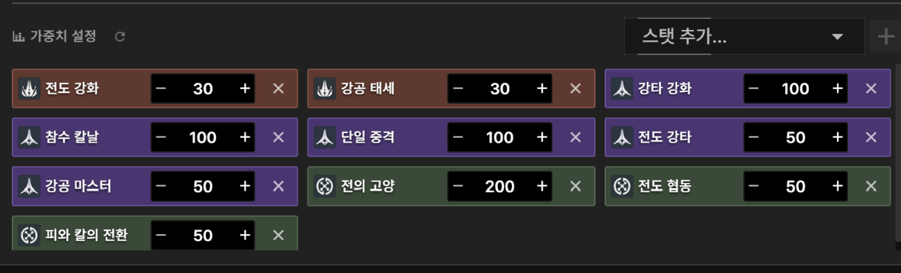

각 스탯의 중요도를 숫자로 입력합니다. 숫자가 높을수록 해당 스탯이 포함된 아이템이 선택될 확률이 높아집니다.
* **팁:** 상단의 '스탯 추가' 검색창을 통해 목록에 없는 스탯을 추가할 수도 있습니다.

**4. 알고리즘 실행**

하단의 주황색 **[알고리즘 실행]** 버튼을 누르면 계산된 최적 조합이 표시됩니다. 결과가 마음에 들면 **[장착 확정]**을 눌러 적용하세요.

---

## 💾 편성 저장 & 불러오기

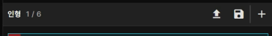

현재 편성한 인형, 아이템 장착 상태, 커스텀 가중치 정보를 **JSON 파일**로 저장하고 언제든 다시 불러올 수 있습니다. 

* **편성 저장:** 툴바의 **[디스크 아이콘]** 을 클릭하여 저장
* **편성 로드:** 저장 아이콘 좌측의 **[로드 아이콘]** 을 클릭하여 파일 선택

---

## ❓ FAQ

**Q. 내 게임 데이터가 서버로 전송되나요?**
> A. 아닙니다. 모든 데이터 처리는 사용자의 브라우저 내에서만 수행되며, 어떠한 정보도 외부 서버로 전송되지 않습니다. 안심하고 사용하세요.

**Q. 모바일에서도 사용할 수 있나요?**
> A. 현재는 **Windows PC + Chrome 데스크톱 환경** 위주로 개발 및 테스트되었습니다. 모바일 환경에서는 화면이 깨지거나 기능이 동작하지 않을 수 있습니다.

## 📚 그 외
* 이 프로젝트에서 사용하고 있는 내부 데이터 셋은 [RPFV Data Sheet](https://docs.google.com/spreadsheets/d/15-HV4FHWfe0FEiJqcMUJn6S_2BN4sgQ4zpsGIystq0Y/edit?gid=2144614850#gid=2144614850) 에서 확인할 수 있습니다.