# RPFV 에디터 (Preview)

**RPFV (Remodeling Pattern For Vepley)** 는  
베푸리도 리몰딩 패턴 성장데이터 관리를 쉽고 직관적으로 할 수 있도록 도와주는 웹 기반 에디터입니다.

  

---

## 🚀 시작 가이드

### 1️⃣ 필요한 파일 준비

RPFV Editor를 사용하려면 아래 파일이 필요합니다.

- [gfl2logger-rpfv](https://github.com/lambdalamshare/gfl2logger-rpfv) 툴을 사용해 추출한 **성장데이터 목록 CSV 파일**  
  (예: `gfl2logger_remodings_....csv`)

> 💡 **참고**  
> 데이터가 아직 없다면, 추후 제공될 **테스트 모드**를 통해 기능을 먼저 체험할 수 있습니다.

---

### 2️⃣ 앱 시작 및 데이터 로드

1. [RPFV Editor](https://lambdalamshare.github.io/) 사이트에 접속하면  
   **시스템 초기화** 팝업이 표시됩니다.
2. **「클릭해서 파일 업로드」** 버튼을 눌러 준비한 **CSV 파일**을 업로드합니다.

  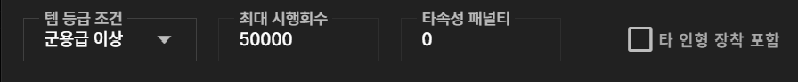

3. 업로드가 완료되면 **실행** 버튼을 클릭하여 메인 인터페이스로 이동합니다.

  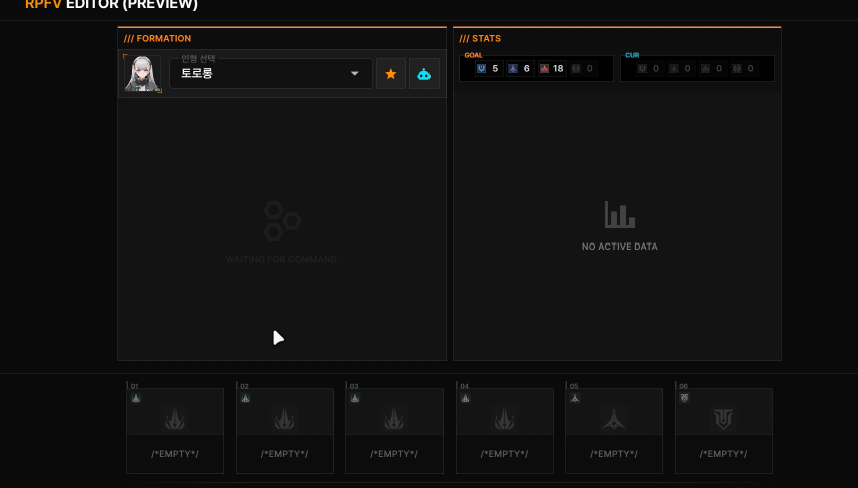

> ⚠️ **주의**  
> 파일 형식이 올바르지 않으면 오류 메시지가 표시됩니다.  
> 반드시 **gfl2-logger 최신 버전**으로 CSV 파일을 생성해주세요.

---

## 🖥 메인 인터페이스 가이드

### 1️⃣ 인형 선택하기

  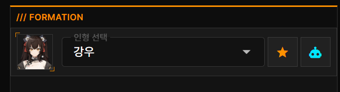

1. 화면 왼쪽 **편성 패널**에서 **「인형 선택」** 드롭다운을 클릭합니다.
2. 원하는 인형을 선택하면 아이콘과 관련 정보가 자동으로 갱신됩니다.

---

### 2️⃣ 성장 아이템 장착하기

#### 아이템 장착 절차

1. 화면 하단 **슬롯 패널**에서 성장 데이터 슬롯을 클릭합니다.

  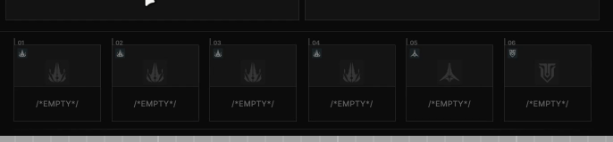

2. 인벤토리 팝업이 열리며 보유 중인 성장데이터 아이템이 표시됩니다.

  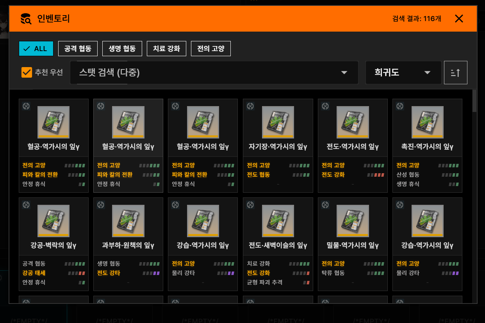

> 💡 **팁**  
> 인벤토리 상단의 **메인 스탯 필터**와 **스탯 검색**을 활용하면  
> 원하는 아이템을 빠르게 찾을 수 있습니다.

3. 아이템 카드를 선택한 뒤, 우상단의 **「장착」** 버튼을 클릭합니다.

  

4. 이미 다른 캐릭터/슬롯에 장착된 아이템은 버튼이 **「교체」**로 표시됩니다.

  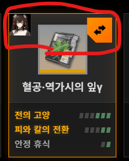

> ⚠️ 교체를 확정하면 기존 장착 캐릭터에서 자동으로 탈착됩니다.

---

### 3️⃣ 리몰딩 스탯 목록 확인

화면 오른쪽 패널에서 **현재 장착된 성장데이터의 스탯 총합**을  
인게임과 유사한 형태로 확인할 수 있습니다.

  

- 상단
  - **목표 형상인자 수치**
  - **현재 형상인자 수**
  - 목표 달성 시 **노란색 테두리**로 강조 표시
- 하단
  - 각 스탯의 **현재 레벨 / 최대 레벨**
  - 표시 규칙
    - ⭐ : 추천 스탯
    - 흰색 바 : 주스탯
    - 빨간 텍스트 : 최대 레벨 초과 경고
  - 스탯 이름 클릭 시 상세 설명 표시

---

## ⚙️ 고급 기능

### 🤖 자동 장착
자동 장착 기능은 **가중치 기반 백트래킹 알고리즘**을 사용하여  
형상인자 조건을 만족하면서도 더 효율적인 스탯 조합을 추천합니다.

  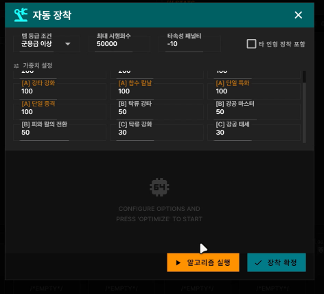

인게임과 비교 [클릭]
 
<table>
  <tr>
    <td align="center">
      
       
      <b>인게임 자동장착(토로로)</b>
    </td>
    <td align="center">
      
       
      <b>RPFV 자동장착(토로로)</b>
    </td>
  </tr>
</table>

#### 사용 방법

1. 왼쪽 캐릭터 패널에서 **로봇 아이콘(🤖)** 클릭

  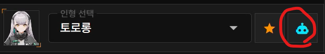

2. **옵션 설정**

  

   - **최소 티어**: 조합에 포함시킬 아이템의 최소 등급
   - **장착된 아이템 포함 여부**: 이 옵션이 켜져있으면 다른 인형에 장착된 아이템도 포함함.
   - **타속성 패널티**: 이 수치가 낮을수록 다른 속성 스탯이 나타날 가능성이 줄어듬 (-10 권장)

3. **가중치 설정**

  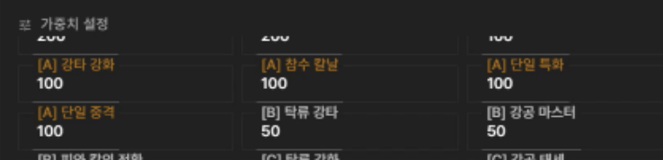

- 가중치가 높을수록 해당 스탯을 포함한 아이템이 선택될 확률 증가
- 잘 모르면 기본값 그대로 진행해도 무방

4. **알고리즘 실행**

  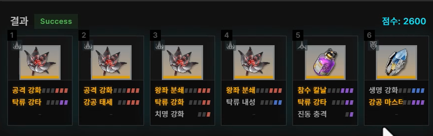

5. **장착 확정** 버튼으로 결과 적용

> 💡 **팁**  
> 결과가 마음에 들지 않으면  
> 시행 횟수 증가 또는 가중치 조정으로 성공 확률을 높일 수 있습니다.

---

### ⭐ 추천 스탯

캐릭터별로 선호하는 성장데이터 스탯을 **추천 스탯**으로 지정할 수 있습니다.

#### 효과
- 아이템 카드에서 노란색 강조
- 우측 스탯 창에 ⭐ 표시
- 자동 장착 시 가중치 반영

#### 사용 방법

1. 왼쪽 캐릭터 패널에서 **별 아이콘(★)** 클릭

  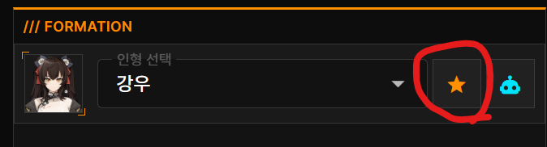

2. 캐릭터 특성에 맞게 지정된 추천 스탯 확인

  

3. 원치 않는 스탯은 ❌ 로 제거

  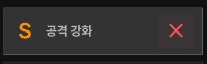

4. 상단에서 새로운 스탯 추가 가능

  

---

## ❓ FAQ

**Q. 내 게임 데이터가 서버로 전송되나요?**  
A. 아닙니다. 모든 처리는 브라우저 내에서만 수행되며 서버로 전송되지 않습니다.

**Q. 모바일에서도 사용할 수 있나요?**  
A. 현재는 **Windows PC + Chrome 데스크톱 환경** 위주로 개발 및 테스트되었습니다.  
모바일 환경은 안정적으로 지원하지 않습니다.

**Q. 편성 데이터를 저장하거나 백업할 수 있나요?**  
A. 현재는 지원하지 않으며, 추후 업데이트 예정입니다.
